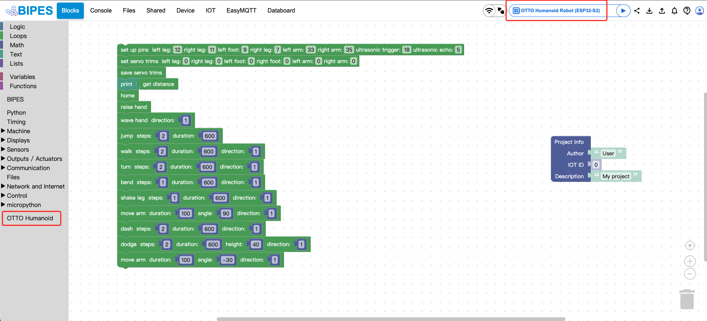

# BIPES: Block based Integrated Platform for Embedded Systems.


BIPES allows anyone to quickly and reliably design, program, build, deploy and test embedded systems and IOT devices and applications. It is fully based on a web environment, so absolutely no software install is needed on the client / developer machine. 

More information at the project website: [bipes.net.br](https://bipes.net.br/).

## Live version
Try it now at: [bipes.net.br/ide](https://bipes.net.br/ide).

## Usage

To init submodules, like [BIPES/freeboard](https://github.com/BIPES/freeboard) and [BIPES/Databoard](https://github.com/BIPES/Databoard), run:
```
make submodules
```

To build/update the offline version with latest, run:
```
make offline
```
This version does not require a server since it has all core files concatanated at `ui/index_offline.html`, just open this file in a browser. It will also create a `bipes_offline.zip`. Howver, keep in mind that any tool that requires a server, like MQTT, won't work due to [CORS](https://developer.mozilla.org/en-US/docs/Web/HTTP/CORS).

That's it, enjoy BIPES 😄.


## Documentation

The documentation is online at [bipes.net.br/docs](https://bipes.net.br/docs).

To build the documentation out of a fresh clone, do:
```
make doc
```
after having installed the theme, [sphinx](https://www.sphinx-doc.org/en/master/) and [sphinx-js](https://pypi.org/project/sphinx-js/).
```
pip install sphinx sphinx-js furo
```
## More information
Some functions of `ui/index.html` were based on Blopy project (https://github.com/mnoriaki/Blopy), by Noriaki Mitsunaga
 (https://github.com/mnoriaki).
 
 OpenCV blocks were automatically generated using berak's OpenCV to Blockly generator (https://github.com/berak/blockly-cv2/tree/master/gen).
 
We also use `xterm.js` (https://github.com/xtermjs/xterm.js/) and `codemirror.js` (https://github.com/codemirror/codemirror).


# Guideline of the OTTO blockly library

This repository is a folk from the official repository of BIPES aiming to extend a blockly library for [OTTO robot](http://ottodiy.com).



## Run this folk right away

1. Clone the folk to local on your computer.
2. Deploy the folder onto a local web server, such as Apache, IIS, or even the built-in server in WebStorm IDE.
3. Visit the index.html in the folder under http://localhost:<your server port>/BIPES/index.html

## Start to program for OTTO robot

1. Make sure you have an OTTO robot running on Micropython firmware and [my customized OTTO Micropython library](https://github.com/robinkam/OttoDIYPython).
2. Select OTTO Humanoid option from the device dropdown list on the right of the top bar. 
3. Choose the connection type on the top bar. 
   1) Bluetooth is not supported
   2) WiFi requires WebREPL activation and WiFi connection on both the robot and the computer.
   3) Serial requires deployment on a https server and a USB cable connecting robot and the computer
4. Write your program using the blocks in the "OTTO Humanoid" library on the left panel.
5. Click the RUN button near the device dropdown list after you have done programming.
